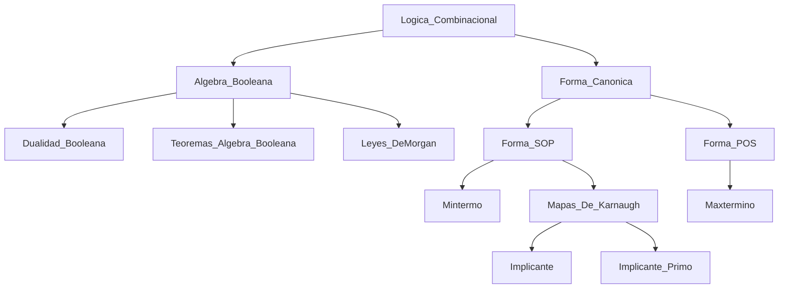

# S02 – Red de conocimiento

## Bitácora

[[S02_Arquitectura_Computadoras_Logica_Combinacional]]

## Conceptos principales

[[Logica_Combinacional]]
[[Logica_Secuencial]]
[[Algebra_Booleana]]
[[Dualidad_Booleana]]
[[Teoremas_Algebra_Booleana]]
[[Leyes_DeMorgan]]
[[Forma_Canonica]]
[[Mintermo]]
[[Maxtermino]]
[[Forma_SOP]]
[[Forma_POS]]
[[Mapas_De_Karnaugh]]
[[Implicante]]
[[Implicante_Primo]]

## Grafo conceptual

